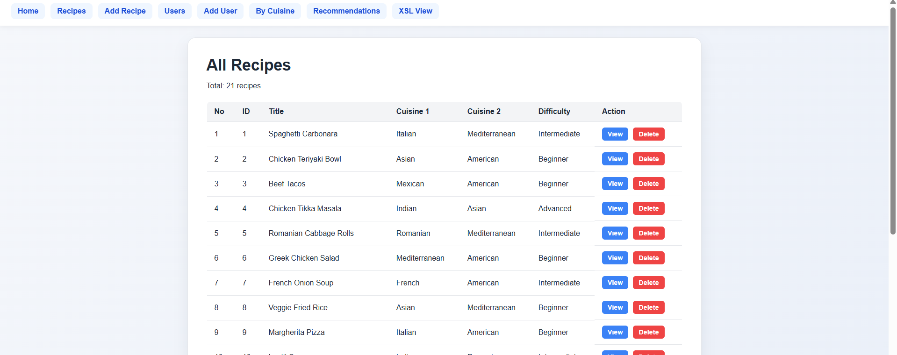
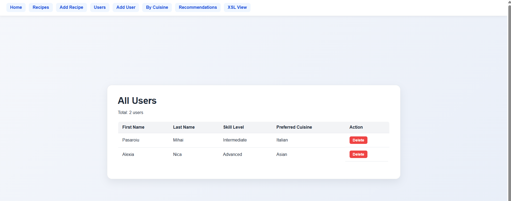
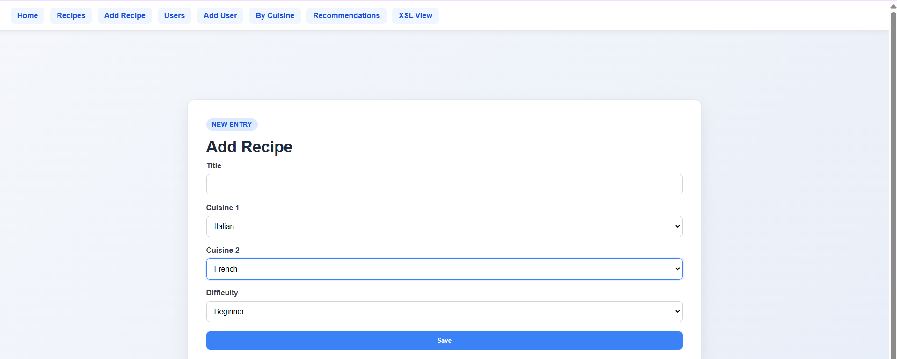
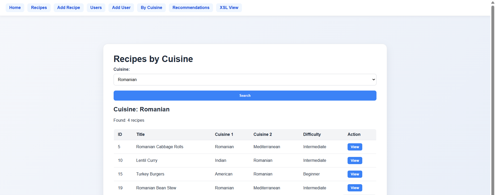
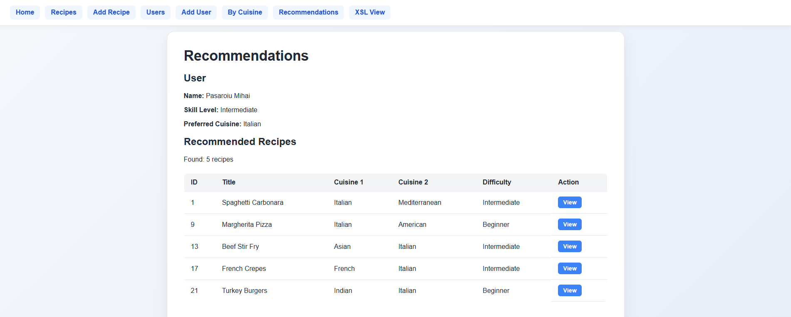
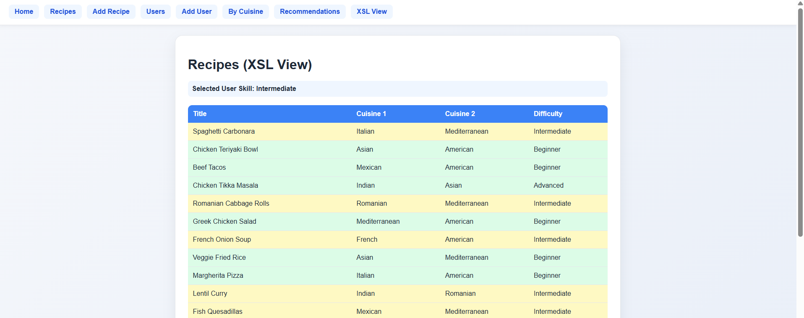

# Recipe Recommender XML

Java Spring Boot application using XML, XPath, and XSLT for recipe management and personalized recommendations.

## Screenshots and Features

### 1. Data Management
Manage recipes and users via XML storage. Includes validation and deletion logic.

### 2. Forms and Filtering
Add data to XML files and filter recipes by cuisine type using dynamic XPath queries.

### 3. Personalized Recommendations
Matches user skill level and preferred cuisine to suggest the best recipes.

### 4. XSLT Styling (Requirement #8)
Dynamic XSL transformation with conditional background colors based on user skill:
* Yellow Background: Matches user skill level.
* Green Background: Non-matching recipes.

---

## Tech Stack
* Language: Java 17
* Framework: Spring Boot (MVC)
* Data: XML, XSD (Validation), XPath (Querying), XSLT (Transformation)
* Frontend: Thymeleaf, CSS3

## Team Members and Contributions
* Mihai Pasaroiu: XML Data Layer, XSD Schema definition, XPath Query implementation, and XML Persistence (Reading/Saving) logic.
* Alexia Nica: UI/UX Design, Navigation and Navigation flow, Thymeleaf Integration, Recommendation logic implementation, and XSL Transformation styling.

---

## Setup and Running
1. Clone the repository: git clone https://github.com/12mihai05/recipe-recommender-xml-java
2. Navigate to project root and run: mvn spring-boot:run
3. Open browser at: http://localhost:8080
